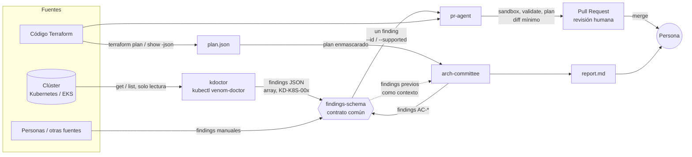
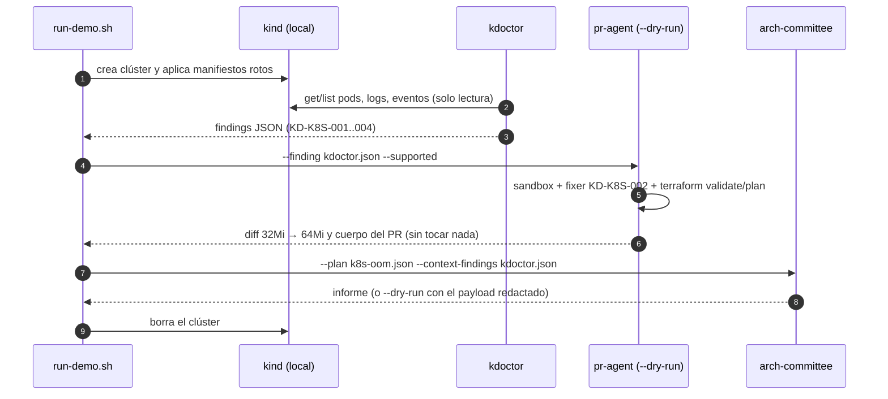

# Arquitectura de VenomOps

VenomOps son tres herramientas que comparten un contrato: el **finding** ([`findings-schema`](../packages/findings-schema)).
Una **detecta** problemas (`kdoctor`), otra los **corrige** abriendo un PR (`pr-agent`) y otra los **debate y prioriza**
antes de producción (`arch-committee`). Ninguna aplica cambios: siempre decide una persona.

## Flujo completo



- **`kdoctor`** lee el clúster (nunca escribe) y emite findings. Sus reglas son KD-K8S-001..004.
- **`pr-agent`** toma UN finding y lo convierte en un PR con el cambio mínimo en Terraform. Nunca hace merge.
- **`arch-committee`** revisa un plan de Terraform con cuatro especialistas y un moderador. Puede recibir findings
  previos (p. ej. de `kdoctor`) como contexto para contrastar el plan con lo que ocurre en producción.
- El contrato común se valida en **ambos lados** (Go y Python) y se prueba que coinciden.

## Secuencia de la demo



Ver [`examples/demo/`](../examples/demo).

## Contratos entre paquetes

| Contrato | Dónde | Detalle |
|---|---|---|
| Finding | [`findings-schema`](../packages/findings-schema), [ADR 0001](decisiones/0001-findings-schema.md) | JSON Schema 2020-12; tipos Go y Python; prueba de paridad |
| Evidencia accionable | [ADR 0004](decisiones/0004-convenciones-evidence.md) | `memory-limit-change`, `required-tags`... |
| Plan de Terraform | `terraform show -json` | Lo lee `arch-committee`; los valores sensibles se enmascaran antes de enviar nada |

## Dónde se hace cumplir la seguridad

Las reglas inviolables de [`CLAUDE.md`](../CLAUDE.md) (sección 2) se aplican **en código**, no solo en prompts:

| Regla | Mecanismo | Paquete |
|---|---|---|
| Nunca `terraform apply/destroy` ni `kubectl` mutante | Lista blanca de invocaciones (`SafeRunner`); `ClusterReader` solo expone get/list | `pr-agent`, `kdoctor` |
| Sin credenciales/IDs en código ni logs | Redactores de secretos; enmascarado de `after_sensitive` | los tres |
| Sin push a `main`, sin `--force` | `git` acotado a ramas `fix/*`; sin operaciones de merge | `pr-agent` |
| LLM opcional y explícito | `--explain`, `--agent` y `--model-id` obligatorios; sin modelo por defecto; `--dry-run` muestra el payload redactado | los tres |
| PRs con aprobación humana | El cliente de GitHub solo abre PRs; checklist de revisión en cada PR | `pr-agent` |

Decisiones: [ADR 0002](decisiones/0002-pr-agent-seguridad.md) (seguridad de pr-agent) y
[ADR 0003](decisiones/0003-orquestacion-arch-committee.md) (orquestación del comité) y
[ADR 0005](decisiones/0005-modelos-bedrock.md) (modelos de Bedrock) y
[ADR 0006](decisiones/0006-comando-venom.md) (comando paraguas `venom`) y
[ADR 0007](decisiones/0007-dependencias-python.md) (dependencias Python) y
[ADR 0008](decisiones/0008-regla-irsa-kdoctor.md) (regla de IRSA de kdoctor, propuesto).

## Mapa del repositorio

```
packages/
  findings-schema/   contrato común (Go + Python)
  kdoctor/           plugin de kubectl (Go)
  pr-agent/          finding -> Pull Request con el arreglo mínimo (Python)
  arch-committee/    comité de agentes que revisa un plan (Python)
examples/
  k8s/               manifiestos rotos para probar kdoctor
  terraform/         repos con fallas deliberadas (pr-agent y arch-committee)
  plans/             terraform show -json de ejemplo (arch-committee)
  findings/          findings de ejemplo, incluida la salida real de kdoctor
  demo/              run-demo.sh: demo reproducible de punta a punta
docs/decisiones/     ADRs
```

## Limitaciones y siguientes pasos

- Solo `KD-K8S-002` se corrige automáticamente desde `kdoctor`; los otros tres findings de Kubernetes piden intervención
  humana o el agente LLM opcional.
- El mapeo Pod → recurso de Terraform exige `metadata.name`/`namespace` literales (deduce Deployments y StatefulSets por
  el nombre del Pod); si son variables, se detiene en lugar de adivinar.
- Los findings de `arch-committee` (`AC-*`) no tienen arreglo automático todavía.
- Las tres rutas con LLM (comité, `kdoctor --explain` y `pr-agent --agent`) se probaron a mano contra Bedrock (Haiku 4.5);
  en CI se usan dobles. La prueba real del comité y del agente corrigió defectos que los dobles no veían (truncación en
  `max_tokens`, `.terraform.lock.hcl` creado por `terraform init`, herramienta de edición sin soporte para números y bucles
  de llamadas fallidas). `--explain` se probó sobre un kind aislado con los cuatro escenarios de `examples/k8s/`: las
  explicaciones salieron correctas, un secreto sembrado en el log llegó como `[REDACTED]` y el JSON validó contra el schema.
